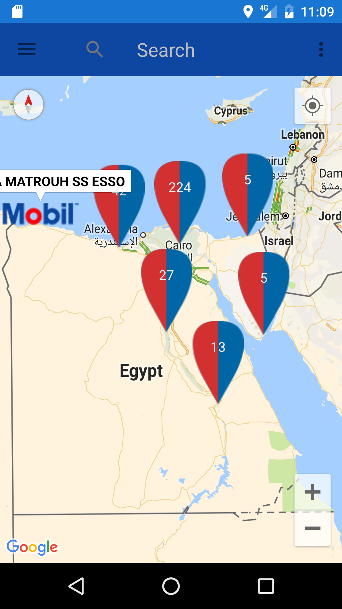
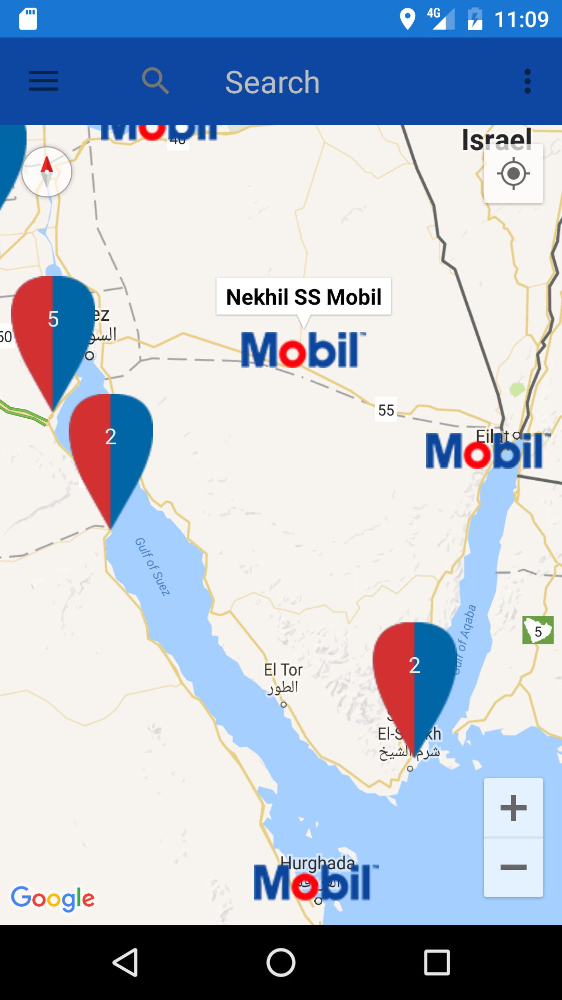
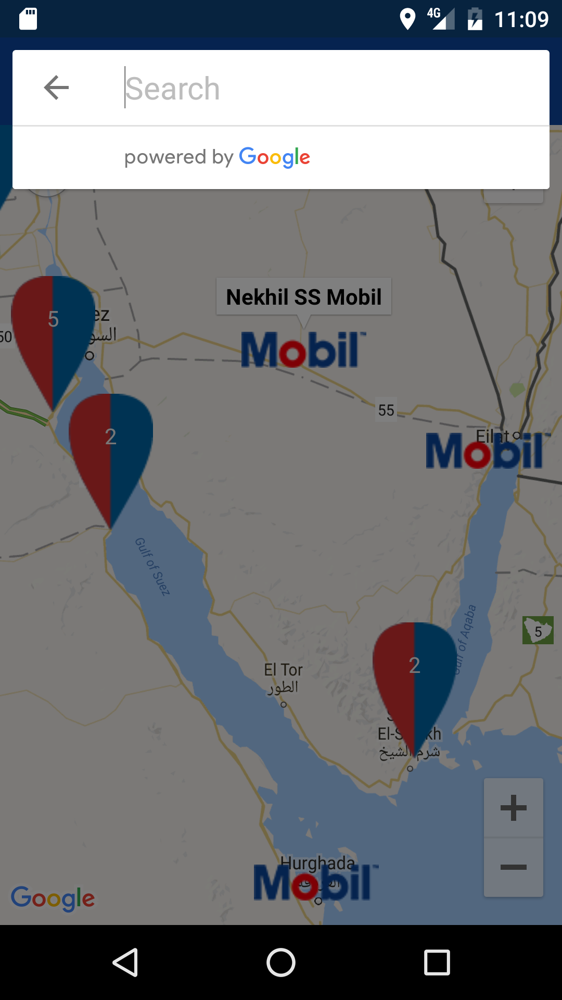
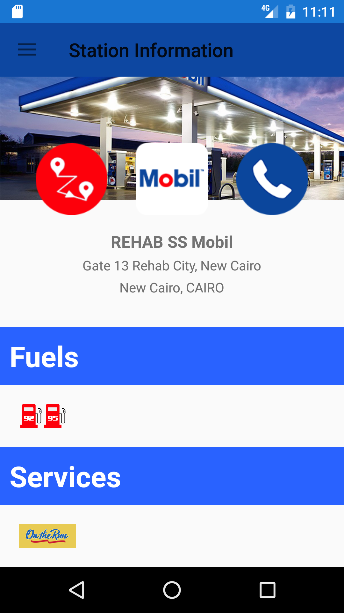
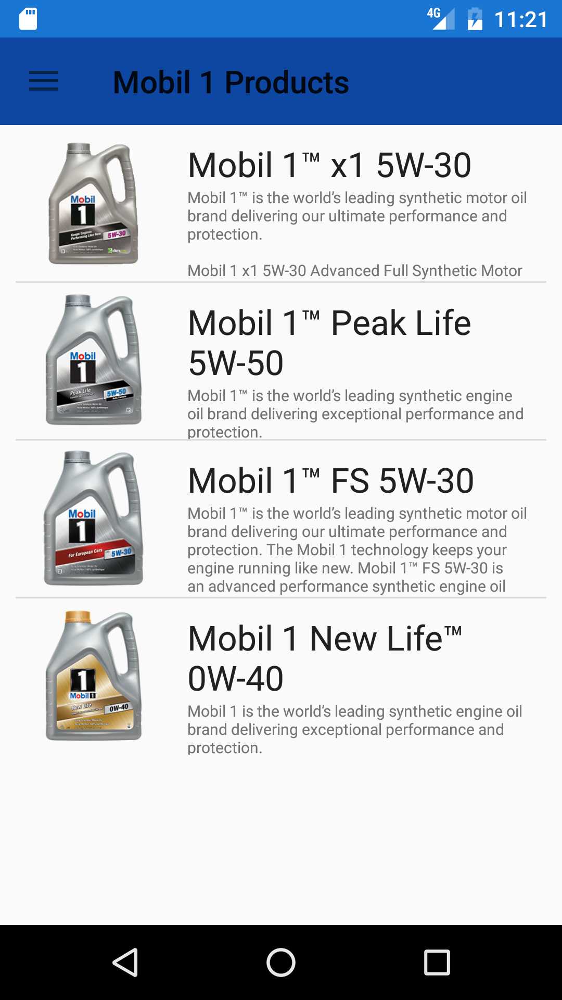
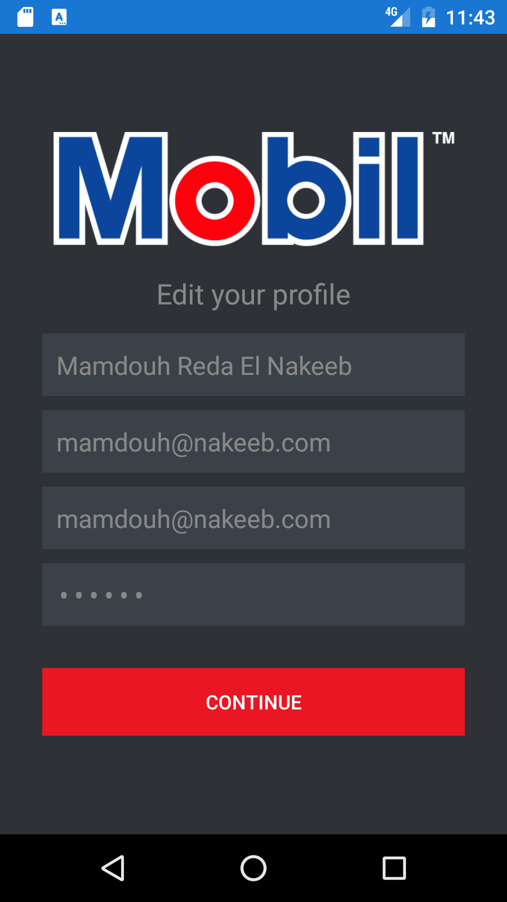
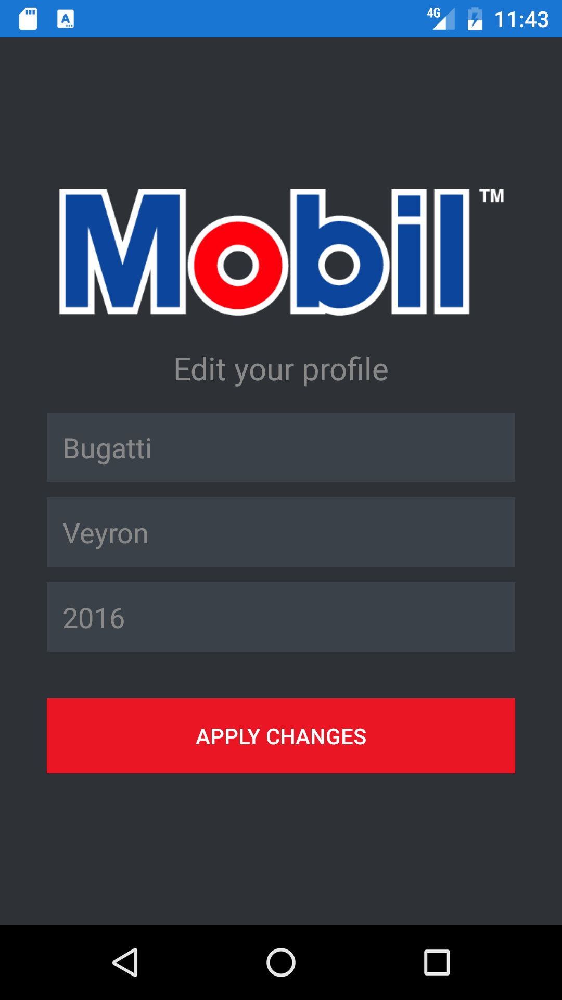
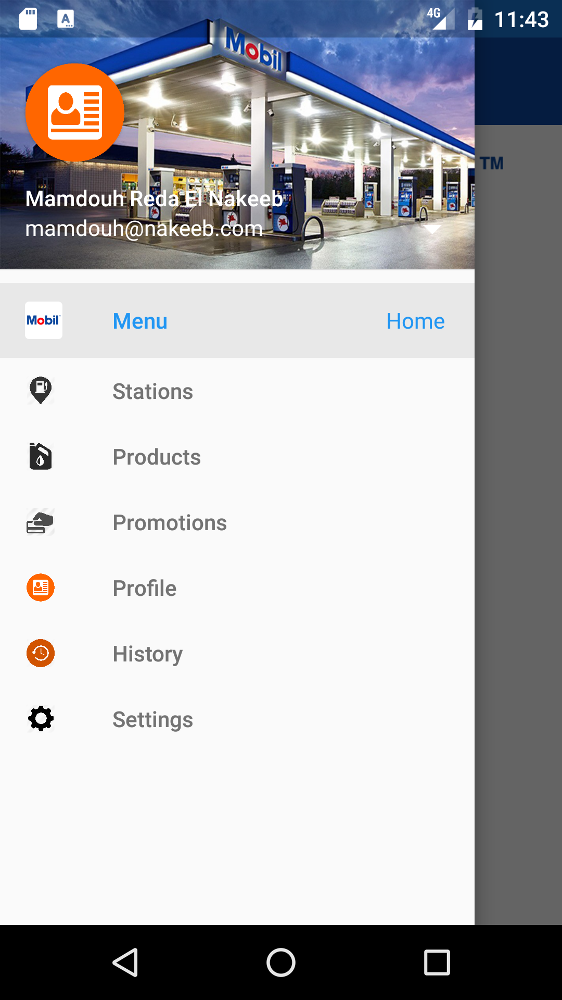

# ExxonMobil - Mobil1 Application
ExxonMobil summer internship

Mobil1 mobile application for connecting Mobil1 users to ExxonMobil Organization.

Application main features:
- Registration system.
- Map has all Mobil1 stations including their details.
- Search for specific region or station.
- Latest Products with all updated details.
- Latest Offers.
- Push Notifications.

My Role:
I was responsible with <a href="https://www.linkedin.com/in/sabah-mohamed-519322120" target="_blank">Sabah Mohamed</a> for developing Mobil1 App for Android, iOS platforms and the backend server during an internship of two months at ExxonMobil Egypt.

Screenshots
-------------

 
 
 
 
 
 
 
 
 
